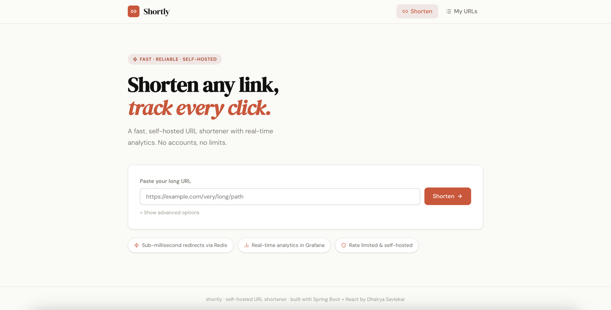
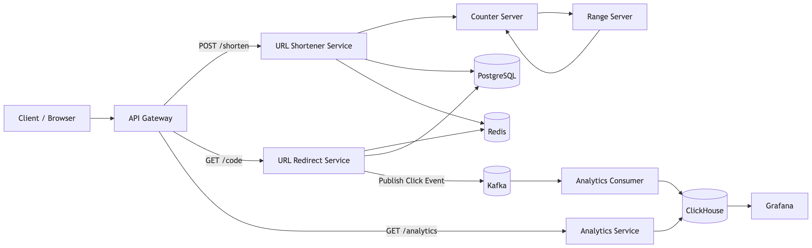
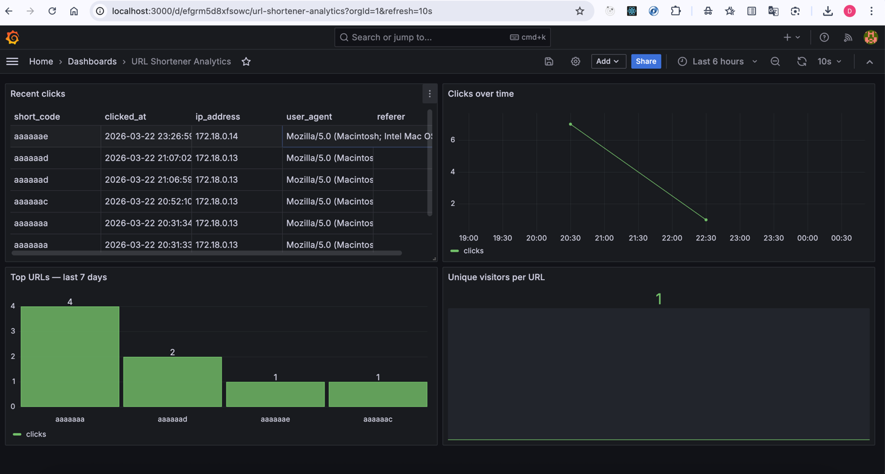
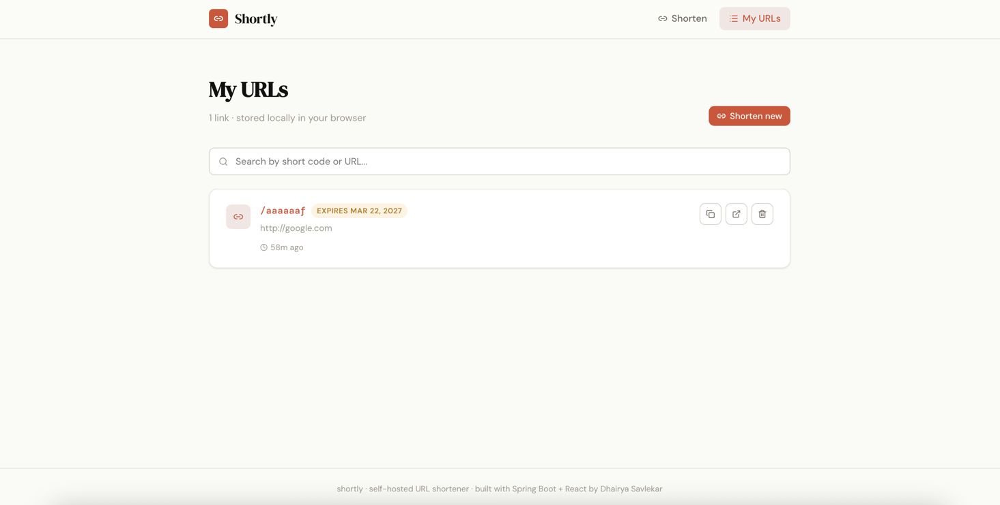

# Shortly — Highly Scalable URL Shortener

> A production-grade, self-hosted URL shortener built on microservices architecture with real-time analytics.



---

## Getting Started

Get the full system running in one command.

### Prerequisites

- Docker Desktop (must be running)
- Git
- 8GB+ RAM available for Docker
- Ports 80, 3000, 3001, 5432, 6379, 8081-8087, 8123, 9092 must be free

### 1. Clone the repository

```bash
git clone <repository-url>
cd url-shortener
```

### 2. Make scripts executable (first time only)

```bash
chmod +x start.sh stop.sh
```

### 3. Start everything

```bash
./start.sh
```

> First run takes **5-10 minutes** to build all Docker images from source. Subsequent runs start in under 30 seconds using Docker cache.

### 4. Access the services

| Service | URL | Credentials |
|---|---|---|
| **Frontend** | http://localhost:3001 | — |
| **API Gateway** | http://localhost:80 | — |
| **Grafana Dashboard** | http://localhost:3000 | admin / admin123 |
| ClickHouse UI | http://localhost:8123/play | default / clickhouse123 |

### 5. Try it out

```bash
# Shorten a URL
curl -X POST http://localhost/shorten \
  -H "Content-Type: application/json" \
  -d '{"longUrl": "https://www.github.com"}'

# Follow the redirect (use the shortCode from above response)
curl -v http://localhost/aaaaaaa

# Check analytics
curl http://localhost/analytics/aaaaaaa
```

### 6. Stop everything

```bash
./stop.sh
```

### Fresh start (wipe all data)

```bash
docker compose -f docker-compose-infra.yml down -v
./start.sh
```

---

## Table of Contents

- [Overview](#overview)
- [System Design — Calculations](#system-design--calculations)
- [Architecture](#architecture)
- [Services](#services)
- [Technology Stack](#technology-stack)
- [Features](#features)
- [API Reference](#api-reference)
- [Analytics Dashboard](#analytics-dashboard)
- [Frontend](#frontend)
- [Testing](#testing)

---

## Overview

Shortly implements the **range-based counter architecture** — a well-known approach used in production URL shorteners to generate globally unique short codes without coordination overhead or distributed locking.

The system is split into dedicated read and write services, uses Redis for sub-millisecond redirects, and streams click events through Kafka into ClickHouse for real-time analytics visualized in Grafana.

---

## System Design — Calculations

### Scale Assumptions

| Metric | Value |
|---|---|
| Total users | 1 billion |
| Active URL creators (10%) | 100 million |
| URLs created per day | 100 million |
| Storage duration | 10 years |
| **Total URLs required** | **365 billion** |

### Short Code Length

Using a 62-character set (`a-z`, `A-Z`, `0-9`):

| Length | Capacity |
|---|---|
| 6 chars | 62^6 = 56.8 billion ❌ not enough |
| **7 chars** | **62^7 = 3.52 trillion ✓** |

**7-character short codes** give us 3.52 trillion unique URLs — more than enough.

### Range-Based Counter

The 3.5T sequence space is divided into **3.5 million ranges** of 1 million each:

```
R1  [0,         1,000,000)  → counter-server-1
R2  [1,000,000, 2,000,000)  → counter-server-2
...
R10 [9,000,000, 10,000,000) → counter-server-10
```

Each counter server owns a range and increments in-memory — no coordination needed between servers.

### Base62 Encoding Example

Converting `9,234,529,445` to a 7-character Base62 string:

```
9234529445 ÷ 62 = 148907051  remainder 23 → x
148907051  ÷ 62 = 2401748    remainder 39 → N
2401748    ÷ 62 = 38702      remainder 4  → e
38702      ÷ 62 = 624        remainder 14 → o
624        ÷ 62 = 10         remainder 4  → e
10         ÷ 62 = 0          remainder 10 → k
```

Result: `keoeNx` (left-padded to 7 chars) → `shortly.com/akeoeNx`

---

## Architecture



### Write Flow

```
Client → API Gateway → URL Shortener Service
                            ↓
                    Counter Server (get next sequence)
                            ↓
                    Base62 Encode → 7-char short code
                            ↓
                    Redis + PostgreSQL (write)
                            ↓
                    Return short URL to client
```

### Read Flow

```
Client → API Gateway → URL Redirect Service
                            ↓
                    Redis lookup (sub-millisecond)
                    (miss → PostgreSQL + warm cache)
                            ↓
                    HTTP 302 redirect → client
                            ↓ (async, non-blocking)
                    Kafka publish (click event)
                            ↓
                    Analytics Consumer → ClickHouse
```

---

## Services

| Service | Port | Responsibility |
|---|---|---|
| `api-gateway` | 80 | Routes all traffic — single entry point |
| `url-shortener-service` | 8085 | `POST /shorten`, `DELETE /{code}` — writes |
| `url-redirect-service` | 8086 | `GET /{code}` — Redis lookup + Kafka publish |
| `analytics-service` | 8087 | `GET /analytics/{code}` — query analytics |
| `analytics-consumer` | 8084 | Kafka consumer → ClickHouse batch writer |
| `range-server` | 8081 | Assigns 1M-wide ranges to counter servers |
| `counter-server` | 8082 | In-memory counter with Redis crash recovery |
| `ui` | 3001 | React frontend |

### Infrastructure

| Service | Port | Purpose |
|---|---|---|
| Redis | 6379 | URL cache + counter checkpoints |
| PostgreSQL | 5432 | Persistent URL metadata |
| ClickHouse | 8123 | Columnar analytics database |
| Kafka | 9092 | Click event streaming |
| Zookeeper | 2181 | Kafka cluster coordination |
| Grafana | 3000 | Analytics dashboard |

---

## Technology Stack

- **Backend** — Spring Boot 3.5 (Java 21), 7 microservices
- **API Gateway** — Spring Cloud Gateway MVC 2025.0.0
- **Message Broker** — Apache Kafka 3.9 + Zookeeper
- **Cache** — Redis 7.2 (allkeys-lru)
- **Relational DB** — PostgreSQL 16
- **Analytics DB** — ClickHouse 24.3 (MergeTree engine)
- **Dashboard** — Grafana 10.4 with ClickHouse plugin
- **Frontend** — React 18 + Vite 5
- **Containerization** — Docker + Docker Compose
- **Rate Limiting** — Bucket4j (token bucket, per-IP)
- **Testing** — JUnit 5 + Mockito + Spring WebMvcTest

---

## Features

### Core
- URL shortening with 7-character Base62 codes
- Custom aliases (`/my-promo`)
- Configurable URL expiry (TTL)
- HTTP 302 redirects (every click tracked)
- URL deactivation (soft delete)
- Cache-aside pattern (Redis → PostgreSQL fallback)

### Analytics
- Real-time click tracking via Kafka
- Total clicks + unique visitors per URL
- Daily click breakdown (30 days)
- Top referers tracking
- Grafana dashboard (auto-provisioned, zero setup)

### Reliability
- Counter crash recovery via Redis checkpointing
- Range re-assignment on server restart
- Async pre-fetching of next range before current exhausts
- Non-blocking analytics — click recording never delays redirects
- Per-IP rate limiting (configurable RPM)

---

## API Reference

All endpoints go through the API Gateway at `http://localhost:80`.

### `POST /shorten`

```bash
curl -X POST http://localhost/shorten \
  -H "Content-Type: application/json" \
  -d '{"longUrl": "https://example.com/very/long/path"}'
```

Optional fields: `customCode` (3-20 alphanumeric chars), `ttlDays` (integer).

Response `201 Created`:
```json
{
  "shortUrl":  "http://localhost/aaaaaaa",
  "shortCode": "aaaaaaa",
  "longUrl":   "https://example.com/very/long/path",
  "createdAt": "2026-03-22T09:00:00Z",
  "expiresAt": "2027-03-22T09:00:00Z"
}
```

### `GET /{shortCode}`

Redirects to the original URL (`302 Found`). Records a click event asynchronously.

```bash
curl -v http://localhost/aaaaaaa
```

### `GET /analytics/{shortCode}`

```bash
curl http://localhost/analytics/aaaaaaa
```

Response `200 OK`:
```json
{
  "shortCode":      "aaaaaaa",
  "longUrl":        "https://example.com",
  "totalClicks":    1024,
  "uniqueVisitors": 876,
  "lastClickedAt":  "2026-03-22T09:00:00Z",
  "dailyClicks":    [{ "date": "2026-03-22", "clicks": 42 }],
  "topReferers":    [{ "referer": "google.com", "clicks": 200 }]
}
```

### `DELETE /{shortCode}`

Deactivates the URL. Returns `204 No Content`.

```bash
curl -X DELETE http://localhost/aaaaaaa
```

---

## Analytics Dashboard



The Grafana dashboard is **auto-provisioned** — no manual setup required. It loads automatically on first start.

### Access

1. Open http://localhost:3000
2. Login — username: `admin`, password: `admin123`
3. Navigate to **Dashboards → URL Shortener Analytics**

### Panels

| Panel | Description |
|---|---|
| Recent clicks | Live table of last 50 click events with IP and user agent |
| Clicks over time | Time-series line chart (last 6 hours) |
| Top URLs | Bar chart of most clicked short codes (7 days) |
| Unique visitors | Distinct visitors per URL (bar gauge) |

Auto-refreshes every 10 seconds.

---

## Frontend



### Home Page (`/`)
- Paste a long URL → get a short URL instantly
- Copy to clipboard with one click
- Advanced options: custom alias + expiry in days

### My URLs (`/urls`)
- All shortened URLs stored locally in the browser
- Search by short code or original URL
- Copy, open in new tab, or deactivate each URL
- Confirm-before-delete protection

---

## Testing

25 tests across 3 test classes:

| Test Class | Tests | Coverage |
|---|---|---|
| `Base62EncoderTest` | 9 | Encoding logic, round-trips, edge cases, error handling |
| `RangeServiceTest` | 9 | Assignment, no-overlaps, exhaustion, **concurrency** |
| `UrlShortenerControllerTest` | 7 | HTTP status codes, validation, rate limiting |

### Run all tests

```bash
cd RangeServer          && mvn test && cd ..
cd UrlShortenerService  && mvn test && cd ..
```

---

*Shortly · self-hosted URL shortener · built with Spring Boot + React*
